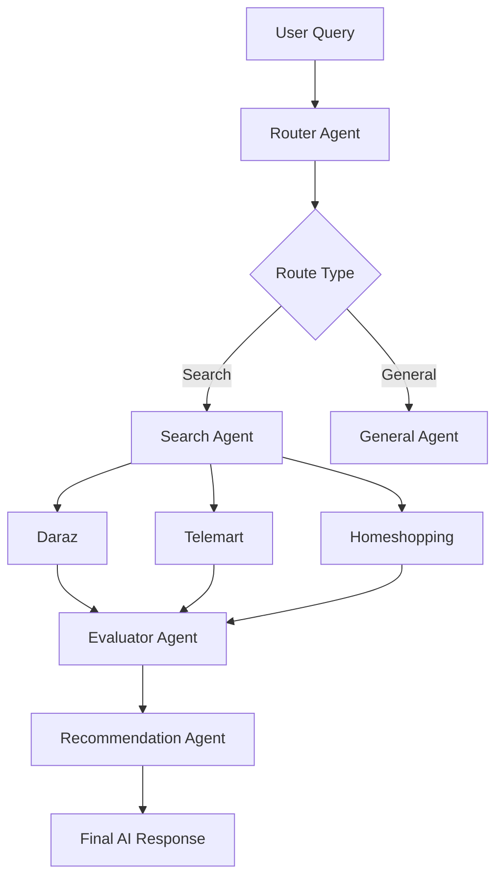
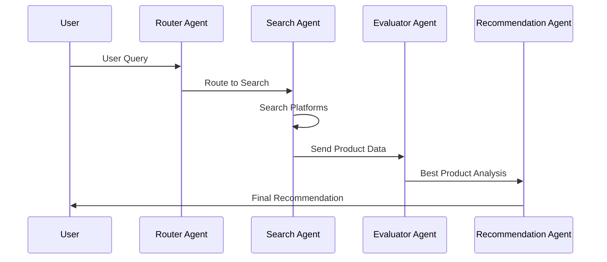
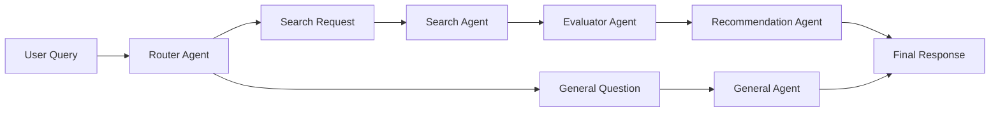

# 🚀 PakShop AI Assistant

> Pakistan’s intelligent AI-powered shopping assistant that compares products across multiple e-commerce platforms in real time.

<div align="center">


</div>

---

# 🧠 About The Project

PakShop AI Assistant is an advanced multi-agent AI shopping assistant designed specifically for Pakistani e-commerce platforms.

It intelligently searches products, compares prices, evaluates deals, and recommends the best buying options from:

- Daraz
- Telemart
- Homeshopping

The system uses an AI agent architecture powered by:

- LangGraph
- FastAPI
- Groq LLM
- Multi-Agent Routing
- Intelligent Product Evaluation

Users can chat naturally like:

```text
“Mujhe 50k ka best phone suggest karo”
“Compare iPhone prices”
“Best gaming laptop under 1 lakh”
```

and the AI responds with smart recommendations, platform links, and product insights.

---

# ✨ Features

## 🤖 AI Multi-Agent Architecture

- Router Agent
- Search Agent
- Recommendation Agent
- Evaluator Agent
- General Conversation Agent

---

## 🛒 Real-Time Product Intelligence

✅ Product comparison  
✅ Multi-platform search  
✅ Smart recommendations  
✅ Price evaluation  
✅ Availability tracking  
✅ Delivery insights

---

## 💬 Modern Chat Experience

- Beautiful dark UI
- ChatGPT-inspired layout
- Typing animations
- Smart loading states
- Session history
- Login & Registration
- Persistent conversations

---

## ⚡ Smart Failure Handling

If a platform becomes slow or unresponsive:

- AI detects timeout automatically
- Partial results are still generated
- User is informed which platform failed
- System avoids full response blocking

---

# 🏗️ System Architecture



---

# 🧠 AI Workflow



---

# 🖥️ UI Preview

## 🌙 Premium Dark Interface

```text
 ---------------------------------------------------------
| Sidebar |                  AI Chat Area        | Product Panel  |
 ---------------------------------------------------------
| Home             | User: Best phone under 50k  | 📱 Samsung A15   |
| Categories       | AI: Here are best options   | ⭐ 4.5 Rating   |
| Saved Items      | Thinking...                 | 💸 Rs. 48,999   |
| Orders           |                             | Price Comparison |
| Delivery Tracker |
| Budget Planner   |
| Settings         |
| Help and Support |
 ---------------------------------------------------------
```

---

# 📂 Project Structure

```bash
pakistan-ecom-assistant/
│
├── agents/
│   ├── base_agent.py
│   ├── router_agent.py
│   ├── search_agent.py
│   ├── recommend_agent.py
│   ├── evaluator_agent.py
│   └── general_agent.py
│
├── static/
│   ├── style.css
│   └── script.js
│
├── app.py
├── graph.py
├── auth.py
├── index.html
├── requirements.txt
└── README.md
```

---

# ⚙️ Tech Stack

| Technology | Purpose |
|---|---|
| Python | Backend |
| FastAPI | API Framework |
| LangGraph | AI Workflow Engine |
| LangChain | LLM Integration |
| Groq | AI Model Provider |
| HTML/CSS/JS | Frontend |
| SQLite | Database |
| JWT | Authentication |

---

# 🚀 Installation

## 1️⃣ Clone Repository

```bash
git clone https://github.com/amna-techcorp17/pakshop-ai-assistant.git
cd pakshop-ai-assistant
```

---

## 2️⃣ Create Virtual Environment

### Windows

```bash
python -m venv venv
venv\Scripts\activate
```

---

## 3️⃣ Install Dependencies

```bash
pip install -r requirements.txt
```

---

## 4️⃣ Configure Environment Variables

Create `.env`

```env
GROQ_API_KEY=your_api_key_here
SECRET_KEY=your_secret_key
```

---

## 5️⃣ Run The Server

```bash
python -m uvicorn app:app --reload
```

---

# 🌐 Open In Browser

```text
http://127.0.0.1:8000
```

---

# 🔥 Example Queries

```text
Find best phone under 50000
Compare iPhone prices
Best gaming laptop in Pakistan
Cheapest Samsung phone
Daraz vs Telemart comparison
```

---

# 🧩 Future Improvements

- AI Memory System 🧠
- Personalized Recommendations
- Real Product Images
- Mobile Responsive Design
- Deployment on Render/Vercel
- Payment Integration


---


---

# 🛡️ Authentication System

✅ User Registration  
✅ JWT Login  
✅ Session Management  
✅ Saved Chat History  
✅ Local + Server Storage

---

# 📊 Agent Decision Flow



---

# 🎯 Why This Project Matters

This project demonstrates:

- AI Agent Engineering
- Multi-Agent Systems
- LangGraph Workflows
- LLM Orchestration
- FastAPI Backend Design
- Modern Frontend UI
- Real-world AI Product Search

---

# 👩‍💻 Author

## Amna Chaudhary

AI Engineer • Python Developer • FastAPI Enthusiast • LangGraph Builder

GitHub: https://github.com/amna-techcorp17

---

# ⭐ Support

If you like this project:

⭐ Star the repository  
🍴 Fork the project  
🧠 Contribute improvements

---

# 📜 License

This project is licensed under the MIT License.

---

<div align="center">

# 💜 PakShop AI Assistant

### Smart Shopping Starts With AI

</div>
